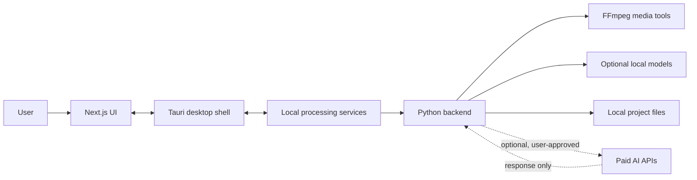
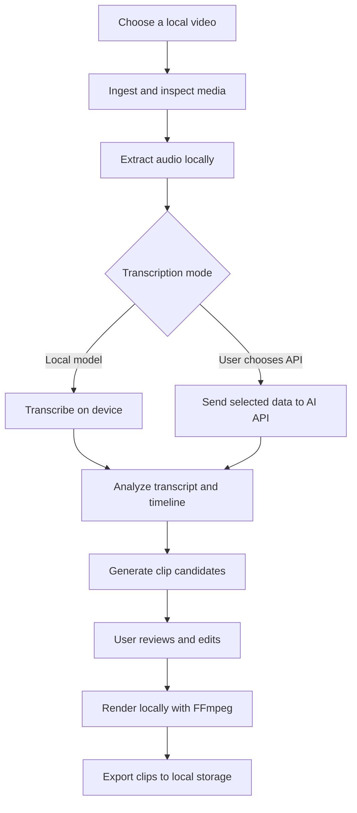

# Clip Robin Project Vision

> Open-source, local-first video clipping for people who want creative automation without handing their media workflow to the cloud.

## Vision

Clip Robin is an open-source desktop application for finding, creating, and preparing short-form video clips. The goal is to make powerful clipping workflows accessible while keeping the user's media, processing, and decisions on the user's own hardware whenever possible.

Clip Robin is being developed around a simple economic and privacy principle:

- Use the user's computer for downloading, media processing, transcription, search, editing, rendering, and storage.
- Use paid AI APIs only where they provide meaningful intelligence that is difficult or expensive to run locally.
- Keep cloud usage optional, visible, and limited rather than making it the default home for the user's media.

This approach aims to reduce recurring costs, improve privacy, provide more control, and make the application useful even when a user wants to keep most of the workflow offline.

## The Problem

Modern video clipping tools often move the entire workflow into hosted services. That can create several problems:

- Recurring subscription costs for processing that a user's computer could perform.
- Upload requirements for private, sensitive, or unreleased recordings.
- Limited control over models, storage, exports, and processing behavior.
- Vendor lock-in around projects and media libraries.
- Dependence on internet availability and service limits.

Clip Robin is intended to offer a different balance: local ownership for the heavy work, with carefully chosen AI services available as a tool rather than a requirement.

## Core Principles

### Local-first processing

The user's machine should perform as much work as practical. This includes media ingestion, FFmpeg processing, transcription when local models are available, clip generation, rendering, and project storage.

### Privacy by design

Local media should stay local by default. Any data sent to a paid AI provider should be clearly identifiable, intentionally requested, and limited to the smallest useful input.

### Pay only for intelligence

AI API spending should be reserved for tasks such as semantic understanding, hook selection, title generation, or clip ranking when the user chooses to use those capabilities. Routine media operations should not require a cloud subscription.

### User ownership and control

Projects, source media, generated clips, metadata, and exports should remain accessible as normal files on the user's hardware. The application should avoid making the user's work dependent on a proprietary hosted account.

### Open source and inspectable behavior

The community should be able to inspect, improve, self-host, and adapt the application. Integrations should be replaceable, and important processing decisions should be understandable rather than hidden behind a service boundary.

### Practical defaults

The application should be approachable for a new user while still exposing meaningful control for advanced users. Good defaults should reduce friction without taking ownership away from the user.

## Planned Architecture

Clip Robin is being built as a Windows desktop application with three major layers:

- **Next.js** for the user interface.
- **Tauri** for the lightweight desktop shell and native desktop integration.
- **Python**, planned as the local AI and video-processing backend.

The cloud path is intentionally narrow. The local path should remain useful on its own, and API providers should be replaceable rather than embedded into the application's identity.

## Processing Workflow

Every major stage should make it clear where work happens, what leaves the device, and what the user can change.

## Cost Model

Clip Robin is designed to minimize unavoidable cloud spending, not to pretend that all AI work is free.

| Capability | Preferred location | Cloud usage |
| --- | --- | --- |
| Media inspection | User hardware | None |
| Audio extraction | User hardware | None |
| Video cutting and rendering | User hardware | None |
| Project storage | User hardware | None |
| Local transcription | User hardware | None |
| Semantic clip analysis | User hardware or selected AI API | Optional |
| Hook, title, and description suggestions | Selected AI API or local model | Optional |
| Clip ranking and refinement | Selected AI API or local model | Optional |

The user should be able to understand and control API usage. Future versions may include provider selection, estimated request cost, usage limits, and prompts before sending media-derived data.

## Privacy Model

Clip Robin's privacy model is based on data locality:

1. Source media is read from local storage.
2. Heavy media operations happen locally.
3. Local project files remain on the user's machine.
4. Cloud requests are opt-in and limited to a defined AI task.
5. API keys are supplied and controlled by the user.
6. The application should document exactly what information an integration sends.

No architecture can guarantee privacy if a user chooses to upload media to a provider. Clip Robin's responsibility is to make that choice explicit and avoid unnecessary transfer.

## Current Development Status

Clip Robin is in early development.

### Present foundation

- Next.js interface scaffolded.
- Tauri desktop project initialized inside the frontend project.
- Windows MSVC toolchain configured for native Rust builds.
- Initial interface and projects view in progress.
- Tauri Rust dependencies compile successfully with the configured developer environment.
- Initial project commit pushed to GitHub.

### Planned work

- Define the local Python backend contract.
- Connect Tauri commands to local processing services.
- Add media import and project management.
- Integrate FFmpeg-based inspection, cutting, and rendering.
- Add local transcription support.
- Add optional provider adapters for paid AI APIs.
- Expose privacy and cost controls in the interface.
- Add tests for processing jobs, project files, and provider boundaries.
- Package and distribute the Windows desktop application.

## What Clip Robin Is Not

Clip Robin is not intended to require a mandatory hosted editing subscription, upload every source video to a central service, or hide the user's projects behind a proprietary cloud database.

It is also not limited to one AI provider. Provider integrations should remain modular so users and contributors can change models, services, or local alternatives as the project evolves.

## Contribution Direction

Contributors can help by improving any layer of the system:

- Desktop experience and accessibility.
- Next.js interface and project workflows.
- Tauri commands and Windows integration.
- Python processing services.
- FFmpeg workflows and media reliability.
- Local model integrations.
- AI provider adapters and cost controls.
- Documentation, tests, packaging, and privacy review.

The long-term goal is a tool that is useful because it respects the user's hardware, files, budget, and choices.

## Repository

The project is developed in the [ClipRobin GitHub repository](https://github.com/abdullohtariq/ClipRobin). The current application code lives in the `frontend` project, with the Python backend planned as the processing layer alongside it.
