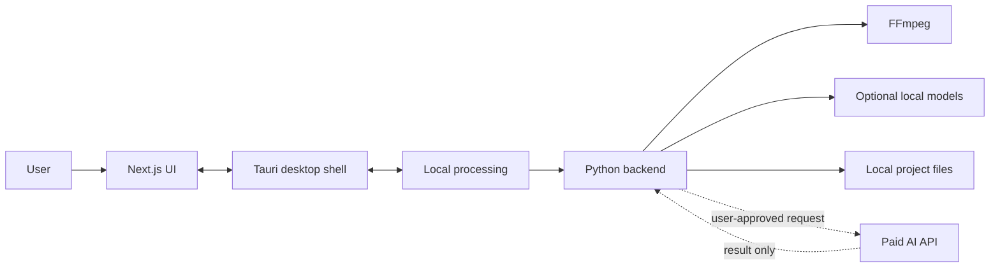
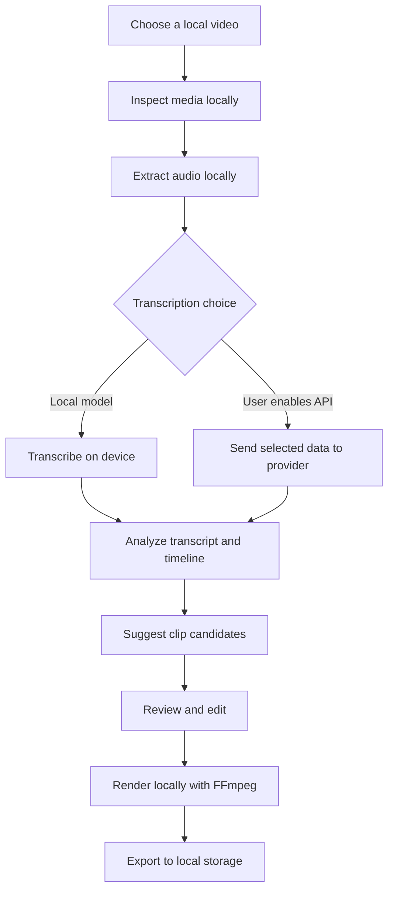

# Clip Robin

> Open-source, local-first video clipping for creators who want automation without surrendering their media workflow to the cloud.

Clip Robin is a Windows desktop application for finding, shaping, and exporting short-form video clips. It is being built around a straightforward idea: your computer should do the heavy work, while paid AI services should be optional tools for the moments where semantic intelligence is worth paying for.

That means lower recurring costs, more privacy, and more control over the files, models, providers, and workflow behind every clip.

## Why Clip Robin?

Many modern clipping products upload the entire workflow to a hosted service. That can mean subscriptions for work a user's computer can already perform, sensitive recordings leaving local storage, and projects becoming dependent on a vendor's account or platform.

Clip Robin takes a different route:

- **Local by default:** media inspection, transcription, cutting, rendering, and project storage should happen on the user's hardware whenever practical.
- **AI where it matters:** paid APIs can help with semantic analysis, clip ranking, hooks, titles, and descriptions, but they are not required for routine media work.
- **Explicit cloud boundaries:** cloud requests should be opt-in, understandable, limited, and replaceable.
- **Open and inspectable:** the project, integrations, and important processing decisions should remain visible to users and contributors.

## How It Fits Together

Clip Robin is a desktop application made of three cooperating layers:

- **Next.js** provides the interface.
- **Tauri** provides the lightweight Windows desktop shell and native integration.
- **Python** is the planned local processing and AI backend.



The cloud path is intentionally narrow. Clip Robin should remain useful when a user wants to work offline or does not want to send media-derived data to a provider.

## The Clipping Flow



Each stage should make three things clear: where the work happens, what data leaves the device, and what the user can change.

## Cost and Privacy Model

Clip Robin is designed to minimize unavoidable cloud spending, not to pretend that AI has no cost. The user's hardware handles the predictable, repeatable work; API spending is reserved for optional intelligence.

| Capability | Preferred location | Cloud usage |
| --- | --- | --- |
| Media inspection | User hardware | None |
| Audio extraction | User hardware | None |
| Video cutting and rendering | User hardware | None |
| Project storage | User hardware | None |
| Local transcription | User hardware | None |
| Semantic clip analysis | Local model or selected API | Optional |
| Hook, title, and description suggestions | Local model or selected API | Optional |
| Clip ranking and refinement | Local model or selected API | Optional |

The intended privacy boundary is simple:

1. Source media is read from local storage.
2. Heavy processing happens locally.
3. Projects, exports, and metadata remain local files.
4. API requests are opt-in and limited to a defined task.
5. Users provide and control their own API keys.
6. Integrations document exactly what they send.

No application can make an upload private once a user chooses to send it to a provider. Clip Robin's job is to make that choice visible and avoid unnecessary transfer.

## Development Status

Clip Robin is in early development.

### Working foundation

- Next.js interface scaffolded.
- Tauri desktop project initialized inside `frontend`.
- Windows MSVC and Windows SDK environment configured for native Rust builds.
- Initial dashboard and projects view in progress.
- Tauri Rust dependencies compile successfully.
- Unified repository structure pushed to GitHub.

### Next milestones

- Define the local Python backend contract.
- Connect Tauri commands to local processing services.
- Add media import and project management.
- Integrate FFmpeg inspection, cutting, and rendering.
- Add local transcription support.
- Add replaceable adapters for paid AI providers.
- Expose privacy, provider, and cost controls in the interface.
- Add tests for jobs, project files, and provider boundaries.
- Package and distribute the Windows desktop application.

## Repository Layout

```text
ClipRobin/
|- frontend/   Next.js UI and Tauri desktop application
|- backend/    Python processing services, in development
|- README.md   Project overview, vision, architecture, and setup
|- Guide.txt   Early workflow notes
```

## Local Development

Start the web interface:

```powershell
cd frontend
npm install
npm run dev
```

Run the Windows desktop application:

```powershell
cd frontend
npx.cmd tauri dev
```

The Tauri build requires the Visual Studio C++ build tools and Windows SDK. The shared VS Code terminal profile in `frontend/.vscode/settings.json` initializes the native build environment.

## Contributing

Contributions are welcome across the whole stack:

- Desktop experience and accessibility
- Next.js interface and project workflows
- Tauri commands and Windows integration
- Python processing services
- FFmpeg reliability and media workflows
- Local model integrations
- AI provider adapters and cost controls
- Tests, packaging, documentation, and privacy review

The long-term goal is a tool that respects the user's hardware, files, budget, and choices. Read the code, run it locally, and help shape the boundaries between local processing and optional AI services.

## License

Clip Robin is currently in development. Licensing details will be added before the first public release.

## Links

- [GitHub repository](https://github.com/abdullohtariq/ClipRobin)
