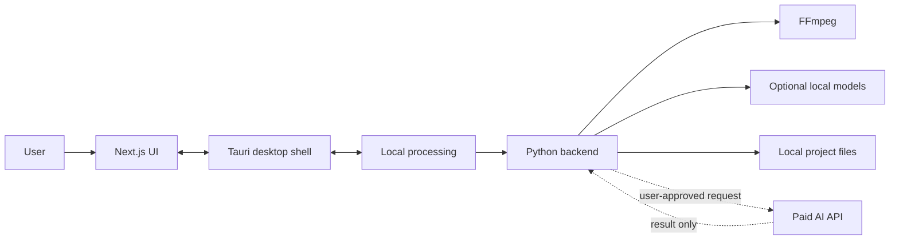
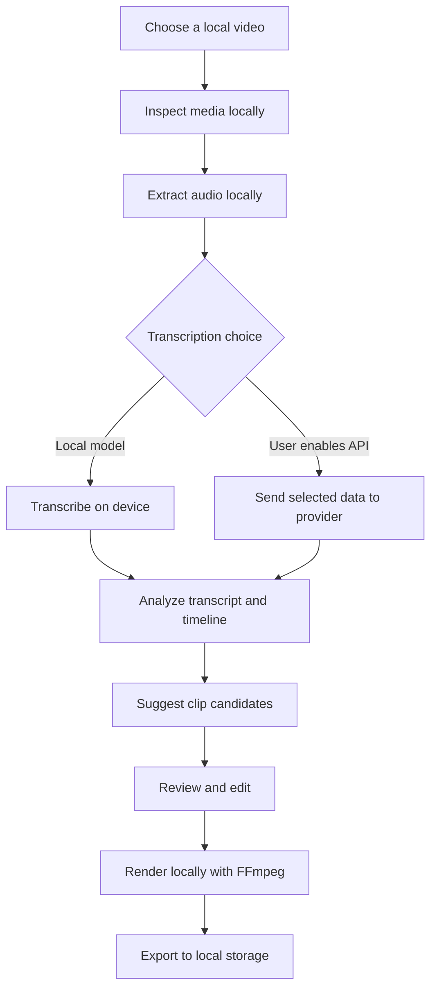

# Clip Robin

> Open-source, local-first video clipping for creators who want automation without surrendering their media workflow to the cloud.

Clip Robin is a Windows desktop application for finding, shaping, and exporting short-form video clips. It is being built around a straightforward idea: your computer should do the heavy work, while paid AI services should be optional tools for the moments where semantic intelligence is worth paying for.

That means lower recurring costs, more privacy, and more control over the files, models, providers, and workflow behind every clip.

## Why Clip Robin?

Many modern clipping products upload the entire workflow to a hosted service. That can mean subscriptions for work a user's computer can already perform, sensitive recordings leaving local storage, and projects becoming dependent on a vendor's account or platform.

Clip Robin takes a different route:

- **Local by default:** media inspection, transcription, cutting, rendering, and project storage should happen on the user's hardware whenever practical.
- **AI where it matters:** paid APIs can help with semantic analysis, clip ranking, hooks, titles, and descriptions, but they are not required for routine media work.
- **Explicit cloud boundaries:** cloud requests should be opt-in, understandable, limited, and replaceable.
- **Open and inspectable:** the project, integrations, and important processing decisions should remain visible to users and contributors.

## How It Fits Together

Clip Robin is a desktop application made of three cooperating layers:

- **Next.js** provides the interface.
- **Tauri** provides the lightweight Windows desktop shell and native integration.
- **Python** is the planned local processing and AI backend.



The cloud path is intentionally narrow. Clip Robin should remain useful when a user wants to work offline or does not want to send media-derived data to a provider.

## The Clipping Flow



Each stage should make three things clear: where the work happens, what data leaves the device, and what the user can change.

## Cost and Privacy Model

Clip Robin is designed to minimize unavoidable cloud spending, not to pretend that AI has no cost. The user's hardware handles the predictable, repeatable work; API spending is reserved for optional intelligence.

| Capability | Preferred location | Cloud usage |
| --- | --- | --- |
| Media inspection | User hardware | None |
| Audio extraction | User hardware | None |
| Video cutting and rendering | User hardware | None |
| Project storage | User hardware | None |
| Local transcription | User hardware | None |
| Semantic clip analysis | Local model or selected API | Optional |
| Hook, title, and description suggestions | Local model or selected API | Optional |
| Clip ranking and refinement | Local model or selected API | Optional |

The intended privacy boundary is simple:

1. Source media is read from local storage.
2. Heavy processing happens locally.
3. Projects, exports, and metadata remain local files.
4. API requests are opt-in and limited to a defined task.
5. Users provide and control their own API keys.
6. Integrations document exactly what they send.

No application can make an upload private once a user chooses to send it to a provider. Clip Robin's job is to make that choice visible and avoid unnecessary transfer.

## Development Status

Clip Robin is in early development, but the first end-to-end filesystem pipeline is now in place.

### Working now

- Next.js interface scaffolded.
- Tauri desktop project initialized inside `frontend`.
- Windows MSVC and Windows SDK environment configured for native Rust builds.
- FastAPI backend connected to the desktop UI with CORS support.
- YouTube URL download flow using `yt-dlp`.
- Local video drag-and-drop and Windows file-picker flow.
- Local timestamped transcription using `faster-whisper`.
- Filesystem project storage under `backend/data/projects`.
- Mock transcript analysis that creates `analysis.json`.
- FFmpeg clip-generation service and MP4 clip serving API.
- Clips page with native HTML video previews.
- Projects and basic Settings pages.
- OpenAI, DeepSeek, and Gemini analyzer adapters are implemented but not called by the mock clip-generation flow.

### Current pipeline

```text
Source video
	-> transcript.json
	-> mock analysis.json
	-> FFmpeg clip generation
	-> clips API
	-> Next.js video preview
```

The code is ready for the pipeline, but **FFmpeg must be installed separately** before actual MP4 clips can be generated. Verify the installation with:

```powershell
ffmpeg -version
```

If FFmpeg is unavailable, the backend returns an explicit setup error instead of silently using a different processor.

### Still to do

- Install and verify FFmpeg on supported machines.
- Test real source videos through download, transcription, analysis, and cutting.
- Replace mock analysis with an opt-in provider selected from OpenAI, DeepSeek, or Gemini.
- Connect generated clips to richer project detail/history views.
- Add clip naming, deletion, export, and open-folder actions.
- Add reliable job progress and cancellation for long videos.
- Add automated backend tests and frontend interaction tests.
- Connect the settings UI to persisted local preferences.
- Add optional vertical crops, captions, and other editing features later.
- Package and distribute the Windows desktop application.

## Repository Layout

```text
ClipRobin/
|- frontend/   Next.js UI and Tauri desktop application
|- backend/    FastAPI routes and local processing services
|- README.md   Project vision, progress, architecture, and setup
```

## Local Development

Start the web interface:

```powershell
cd frontend
npm install
npm run dev
```

Install backend dependencies and start FastAPI:

```powershell
cd backend
..\.venv\Scripts\activate
python -m pip install -r requirements.txt
python -m uvicorn app.main:app --reload --port 8000
```

Run the Windows desktop application:

```powershell
cd frontend
npx.cmd tauri dev
```

The Tauri build requires the Visual Studio C++ build tools and Windows SDK. The shared VS Code terminal profile in `frontend/.vscode/settings.json` initializes the native build environment.

### API surface

```text
GET  /api/health
POST /api/download
POST /api/local-video/transcribe
POST /api/projects/{id}/transcribe
POST /api/projects/{id}/generate-clips
GET  /api/projects/{id}/clips
GET  /api/projects/{id}/clips/{file}
GET  /api/projects
POST /api/analyze
```

The analysis endpoint supports provider configuration through environment variables, but the current clip-generation workflow intentionally uses mock analysis while the local video pipeline is being verified.

## Contributing

Contributions are welcome across the whole stack:

- Desktop experience and accessibility
- Next.js interface and project workflows
- Tauri commands and Windows integration
- Python processing services
- FFmpeg reliability and media workflows
- Local model integrations
- AI provider adapters and cost controls
- Tests, packaging, documentation, and privacy review

The long-term goal is a tool that respects the user's hardware, files, budget, and choices. Read the code, run it locally, and help shape the boundaries between local processing and optional AI services.

## License

Clip Robin is currently in development. Licensing details will be added before the first public release.

## Links

- [GitHub repository](https://github.com/abdullohtariq/ClipRobin)
